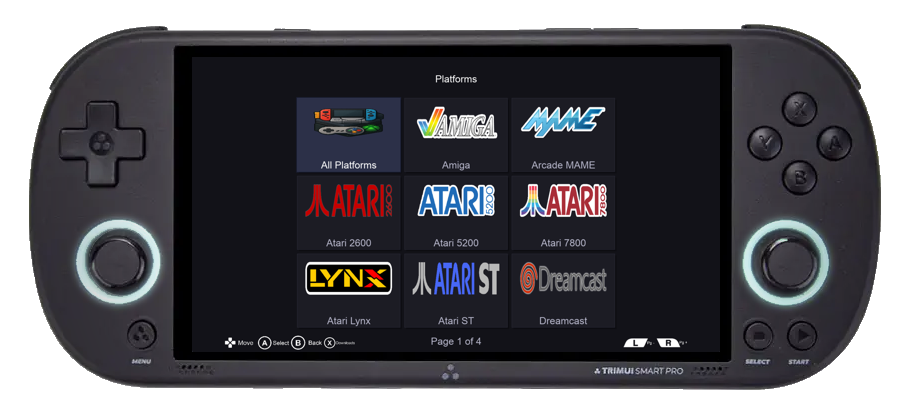
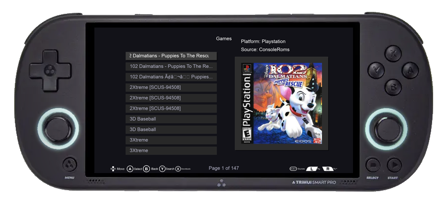
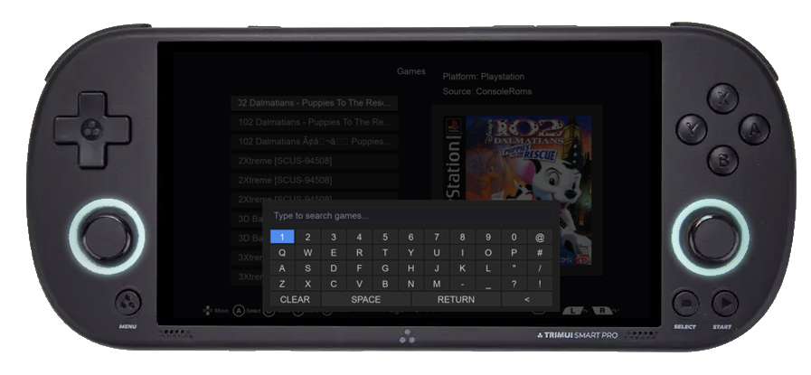
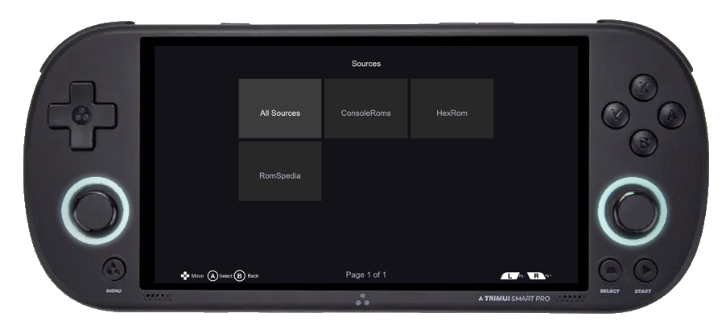
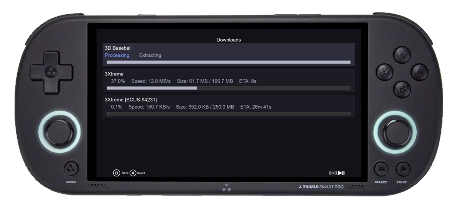

# EmuDrop

A modern, user-friendly game ROM downloader application mainly for Trimui Smart Pro and Trimui Brick developed using Python and SDL2. This application provides a sleek interface for browsing and downloading retro game ROMs with a controller-friendly design.

## ☕ Support Me
If you like this project, consider supporting me on Buy Me a Coffee:

<p align="center">
  <a href="https://buymeacoffee.com/ahmadteeb" target="_blank">
    
  </a>
</p>

## 🎮 Devices Support

<div align="center">

<table>
  <thead>
    <tr>
      <th>Device Name</th>
      <th>OS</th>
    </tr>
  </thead>
  <tbody align="center">
    <tr><td>TrimUI Smart Pro</td><td><code>Stock</code> <code>Crossmix</code> <code>Knulli</code></td></tr>
    <tr><td>TrimUI Brick</td><td><code>Stock</code> <code>Crossmix</code> <code>Knulli</code></td></tr>
    <tr><td>RG35XX Original</td><td><code>Knulli</code></td></tr>
    <tr><td>RG35XX 2024</td><td><code>Knulli</code></td></tr>
    <tr><td>RG35XX Plus</td><td><code>Knulli</code></td></tr>
    <tr><td>RG35XX SP</td><td><code>Knulli</code></td></tr>
    <tr><td>RG35XX-H</td><td><code>Knulli</code></td></tr>
    <tr><td>RG35XX-V</td><td><code>Knulli</code></td></tr>
    <tr><td>RG-CubeXX</td><td><code>Knulli</code></td></tr>
  </tbody>
</table>

</div>


## 📸 Screenshots

<div align="center">

### 🎮 Platform Selection

*Browse through a curated collection of gaming platforms. The intuitive interface makes it easy to navigate between different systems.*

### 🎯 Game Selection

*Explore an extensive library of games for your chosen platform. Each game entry includes detailed information and cover art.*

### 🔍 Search & Discovery

*Powerful search functionality with instant results. Find your favorite games quickly with our optimized search engine.*

### 📚 Source Selection

*Filter and discover games from various trusted sources. Easily switch between different ROM providers, each offering unique collections and regional variants. Our intelligent source filtering helps you find the perfect version of your favorite games.*

### ⬇️ Download Center

*Monitor and manage your downloads with real-time progress tracking. Queue multiple downloads and track their status.*

</div>

## Features

- 🎮 Controller Support: Full gamepad support for easy navigation
- ⌨️ On-screen Keyboard: Virtual keyboard for search functionality
- 📱 Modern UI: Clean and intuitive interface built with SDL2
- 🗂️ platform Management: Browse games by platform/platform
- ⬇️ Download Management: Track and manage game downloads
- 🖼️ Rom Imgs Scrapping: Downloading the game 2d art box cover
- 🔍 Search Functionality: Find games quickly
- 📺 Game Preview: View game information and images
- 🎯 Progress Tracking: Visual feedback for downloads
- 💾 Multi-format Support: Handles various ROM formats and compression
- 🔄 Auto Updates: Built-in OTA updates for seamless app maintenance
- 📚 Sources: Game ROMs from different sources
- 🔒 Download Queue: Manage multiple downloads simultaneously
- 🗑️ Cache Management: Automatic cleanup of temporary files
- 📱 Responsive Design: Adapts to different screen sizes
- 🗄️ SQLite Database: Efficient data storage and retrieval
- 📊 Data Analytics: Enhanced search and filtering capabilities
- 🔄 Data Synchronization: Real-time updates and consistency
- 📈 Performance Optimization: Faster data access and queries

## Bugs Solved

- Fixed screen timeout issue when device is left idle
- Fixed memory leaks in SDL2 texture handling
- Resolved controller input lag issues
- Fixed download progress bar accuracy
- Corrected platform detection on Trimui Smart Pro
- Resolved screen tearing during scrolling
- Fixed keyboard input handling on special characters
- Corrected download queue management
- Resolved image caching issues
- Corrected search functionality with special characters
- Resolved download resume functionality
- Fixed screen orientation issues
- Corrected touch input calibration
- Resolved memory management during large downloads
- Fixed UI scaling on different resolutions
- Optimized JSON to SQLite migration process
- Fixed data consistency issues during updates
- Resolved database indexing performance
- Corrected data synchronization conflicts
- Fixed query optimization for large datasets

## Installation
1. Download the latest release for target OS.
    - https://github.com/ahmadteeb/EmuDrop/releases
2. Extract the downloaded file to:
    - Stock/Crossmix OS -> /mnt/SDCARD/Apps/
    - Knulli OS -> /userdata/roms/pygame/
    Note: Run EmuDropKeyConfig from pygame menu to reconfig the key mapping.
## Requirements

- Python 3.6+
- SDL2 and its dependencies
- Required Python packages (listed in requirements.txt)

## Cross-Compiling

1. Clone the repository:
```bash
git clone [repository-url]
cd EmuDrop
```

2. Using WSL2 run the docker container inside tools directory and place the code inside workspace:
```bash
sudo make shell
```

3. Cross compiling the app to Trimui Smart Pro:
```bash
pyinstaller --onefile --noconsole --name EmuDrop main.py
```
4. Place the EmuDrop files from dist/ directory platform/Trimui Smart Pro/EmuDrop
```bash
cp dist/EmuDrop/ platform/Trimui Smart Pro/EmuDrop
```

5. Copy EmuDrop directory to /mnt/SDCARD/Apps/

## Testing

1. Start the application:
```bash
python main.py
```

2. Navigation:
   - Use arrow keys or controller D-pad to navigate menus
   - Press A to select
   - Press B to return to previous menu
   - Press Y to show on-screen keyboard for search
   - Press X to show the downloads status
   - Press L/R for page navigation

3. Downloading Games:
   - Browse platforms or search for specific games
   - Select a game to view details
   - Confirm download when prompted
   - Monitor download progress in the downloads view

## Project Structure

- `app.py`: Main application class and core functionality
- `main.py`: Application entry point
- `ui/`: User interface components
- `utils/`: Utility functions and helpers
- `data/`: Data management and storage
- `platform/`: Platform-specific implementations
- `tools/toolchain`: Toolchain for Trimui Smart Pro using docker image
- `tools/roms scrapper`: Scrapping the Game Roms links form https://www.consoleroms.com.
- `assets/`: Images, fonts, and other resources

## Development

The application is built using:
- PySDL2 for graphics and input handling
- Custom UI components for a controller-friendly interface
- Asynchronous download management
- Efficient resource management with texture caching
- Modular architecture for easy maintenance

## Logging

The application maintains two log files:
- `EmuDrop.log`: General application logs

## Contributing
Contributions are welcome! Please feel free to submit pull requests.

## Acknowledgments

- SDL2 and PySDL2 teams
- Contributors and maintainers
